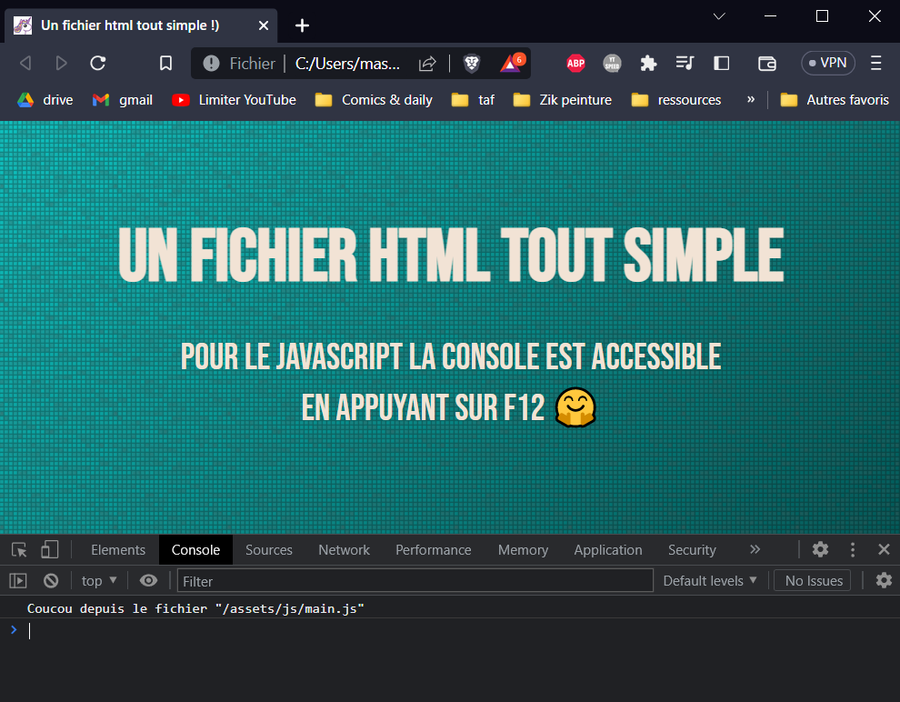

# Pack débutant Javascript

Ce fichier contient la documentation de ce projet, au format [markdown](https://www.markdownguide.org/basic-syntax/).

## Récupération du projet

Récupérez ce projet en cliquant sur ce lien : [https://github.com/youpiwaza/evogue/archive/refs/heads/main.zip](https://github.com/youpiwaza/evogue/archive/refs/heads/main.zip)

Décompressez l'archive, puis il se trouvera dans le dossier `/ressources/packs-debutants/javascript-debutant/`.

## Mise en plac

Lancez simplement le fichier html via votre navigateur (Chrome, Firefox, Opéra, etc.)

