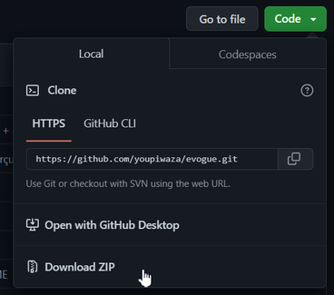

# Packs débutants

Il s'agit de "🏭 Boilerplates" permettants peu ou prou de commencer un langage de programmation sans avoir à tout installer.

Des packs "clés en main", que vous pourrez dupliquer pour chacun de vos exercices / projets.

Vous pouvez les télécharger en en allant à la racine du projet Bouton vert "Code" > "Download ZIP".



## Liste des projets

- [Javascript](./javascript-debutant/)
- [PHP](./php-debutant/)

---

## Notes pour wam

### Affichage de code dans le hmtl

Affichage de code via la librairie [code-prettify](https://github.com/googlearchive/code-prettify)

Utilisation (attention à l'indentation, prise en compte) :

```html
<pre class="prettyprint">
&lt;?php
    echo 'Bonjour tout le monde !';
?&gt;</pre>
```
