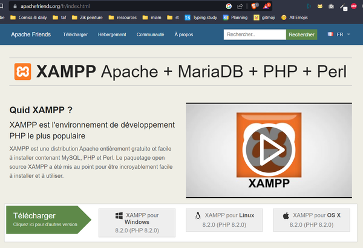
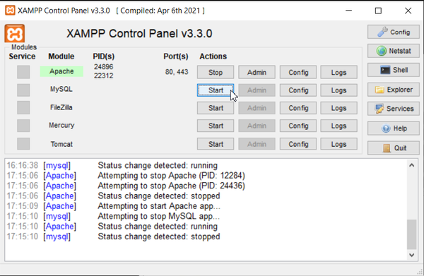
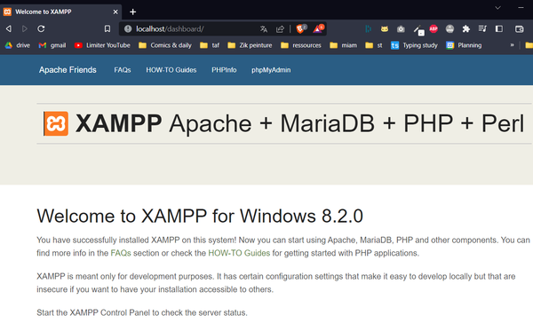
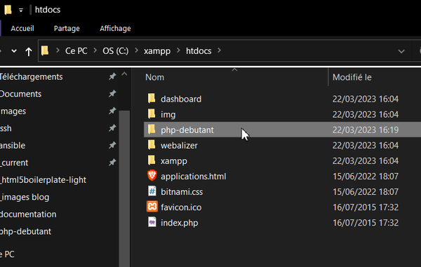
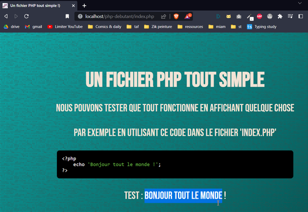
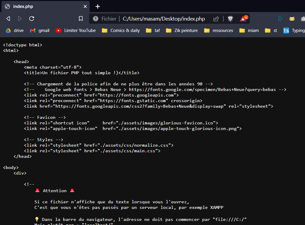

# Pack débutant PHP

Ce fichier contient la documentation de ce projet, au format [markdown](https://www.markdownguide.org/basic-syntax/).

## Récupération du projet

Récupérez ce projet en cliquant sur ce lien : [https://github.com/youpiwaza/evogue/archive/refs/heads/main.zip](https://github.com/youpiwaza/evogue/archive/refs/heads/main.zip)

Décompressez l'archive, puis il se trouvera dans le dossier `/ressources/packs-debutants/php-debutant/`.

## Mise en place

🚨 Attention 🚨

PHP étant un langage serveur, il **doit** passer par un serveur afin de s'exécuter correctement.

Si ce fichier n'affiche que du texte lorsque vous l'ouvrez, c'est que vous n'êtes pas passés par un serveur local, par exemple [XAMPP](https://www.apachefriends.org/fr/).

Quelques étapes à respecter afin de pouvoir exécuter du PHP :

1 / Installer un serveur local (XAMPP) en suivant les instructions
    On peut le trouver [ici](https://www.apachefriends.org/fr/)

---

2 / Notez bien le chemin d'installation, par défaut `C:\xampp`

3 / Vérifier que le programme du serveur est bien lancé (XAMPP Control Panel)

4 / Vérifiez que le serveur est bien lancé (Apache et Mysql doivent être en vert), sinon bouton "Start"

---

5 / Première vérification : Apache > Bouton "Admin", ou accédez dans votre navigateur à [http://localhost/dashboard/](http://localhost/dashboard/)

---

6 / Copiez ce projet packs-debutants "php-debutant" dans `C:\xampp\htdocs\`

---

7 / Accédez dans votre navigateur à [http://localhost/php-debutant/index.php](http://localhost/php-debutant/index.php) (sans `/dashboard` 😉 )

8 / Si ça fonctionne, rajouter le lien dans vos favoris

---

## 💡 Si cela ne fonctionne toujours pas

Dans la barre du navigateur, l'adresse ne doit pas commencer par `file:///C:/` et `"Fichier"` ne doit pas être indiqué

L'adresse doit plutôt ressembler à ~ "localhost/" comme ci-dessus

